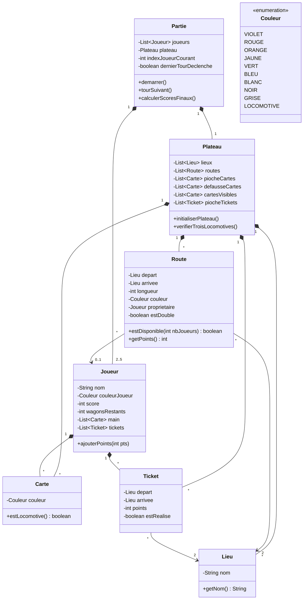

# Diagramme de Classes UML - Séance 1 (v1)

```mermaid
classDiagram
    class Partie {
        -List~Joueur~ joueurs
        -Plateau plateau
        -int indexJoueurCourant
        -boolean dernierTourDeclenche
        +demarrer()
        +tourSuivant()
        +calculerScoresFinaux()
    }

    class Plateau {
        -List~Lieu~ lieux
        -List~Route~ routes
        -List~Carte~ piocheCartes
        -List~Carte~ defausseCartes
        -List~Carte~ cartesVisibles
        -List~Ticket~ piocheTickets
        +initialiserPlateau()
        +verifierTroisLocomotives()
    }

    class Lieu {
        -String nom
        +getNom() String
    }

    class Route {
        -Lieu depart
        -Lieu arrivee
        -int longueur
        -Couleur couleur
        -Joueur proprietaire
        -boolean estDouble
        +estDisponible(int nbJoueurs) boolean
        +getPoints() int
    }

    class Joueur {
        -String nom
        -Couleur couleurJoueur
        -int score
        -int wagonsRestants
        -List~Carte~ main
        -List~Ticket~ tickets
        +ajouterPoints(int pts)
    }

    class Carte {
        -Couleur couleur
        +estLocomotive() boolean
    }

    class Ticket {
        -Lieu depart
        -Lieu arrivee
        -int points
        -boolean estRealise
    }

    class Couleur {
        <<enumeration>>
        VIOLET
        ROUGE
        ORANGE
        JAUNE
        VERT
        BLEU
        BLANC
        NOIR
        GRISE
        LOCOMOTIVE
    }

    Partie "1" *-- "2..5" Joueur
    Partie "1" *-- "1" Plateau
    Plateau "1" *-- "*" Lieu
    Plateau "1" *-- "*" Route
    Plateau "1" *-- "*" Carte
    Plateau "1" *-- "*" Ticket
    Route "*" --> "2" Lieu
    Route "*" --> "0..1" Joueur
    Joueur "1" *-- "*" Carte
    Joueur "1" *-- "*" Ticket
    Ticket "*" --> "2" Lieu
```
